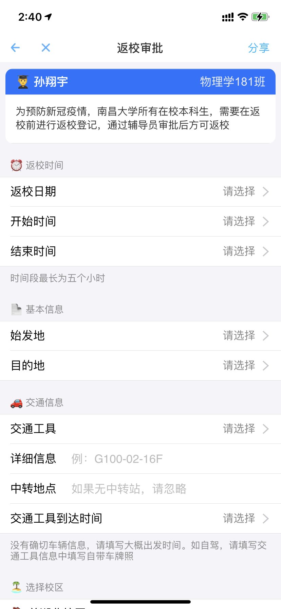
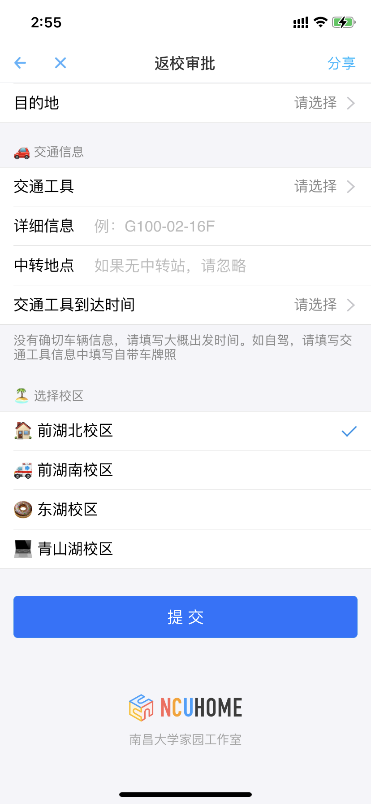

# 返校登记（学生端）

## 预览




## 背景

部署在南大家园 APP 上，负责疫情期间的返校登记

## 使用

本应用基于 [icejs](https://github.com/alibaba/ice) v1.8.3 进行开发，基于其状态管理、约定式路由、esbuild 压缩等能力进行构建

```bash
# 安装依赖
$ npm install

# 启动服务
$ npm start  # visit http://localhost:3333
```

[More docs](https://ice.work/docs/guide/about).
